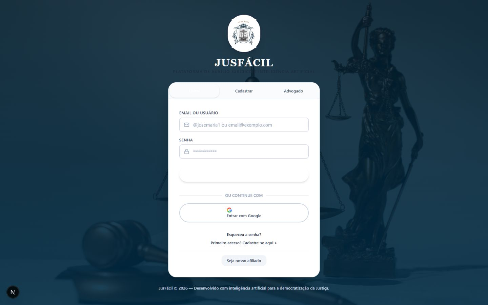
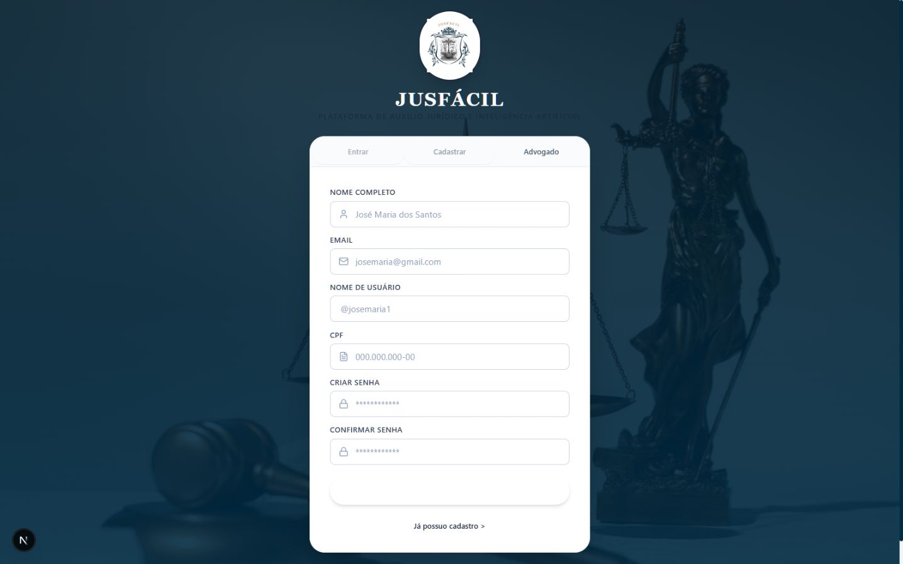
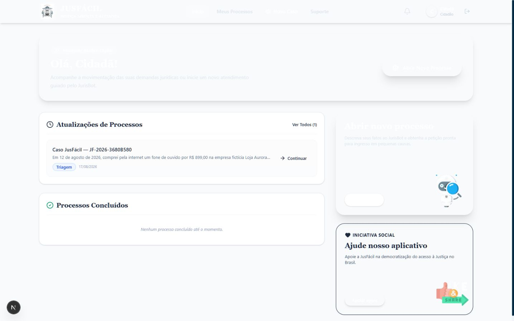
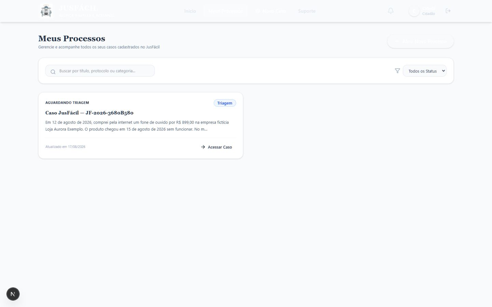
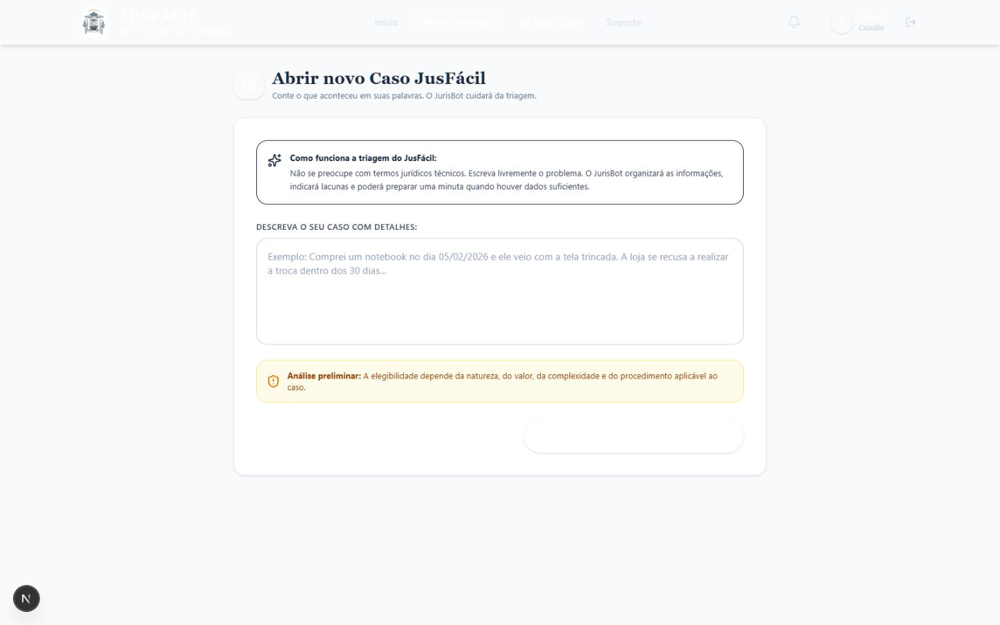
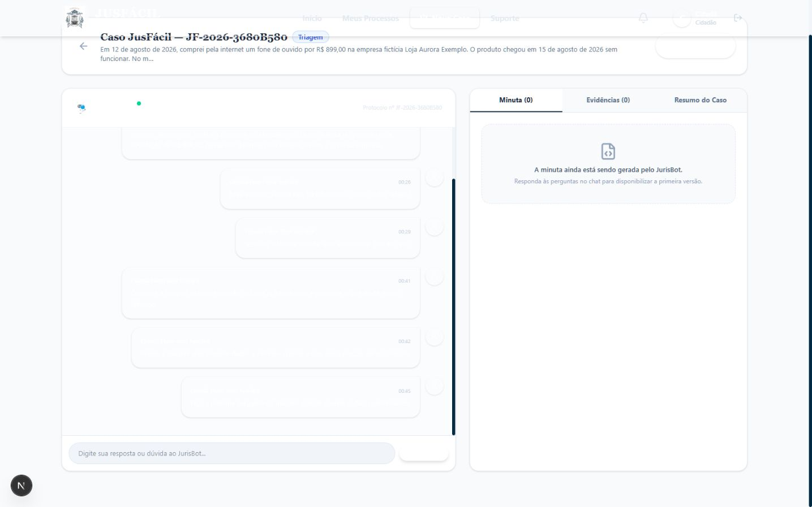
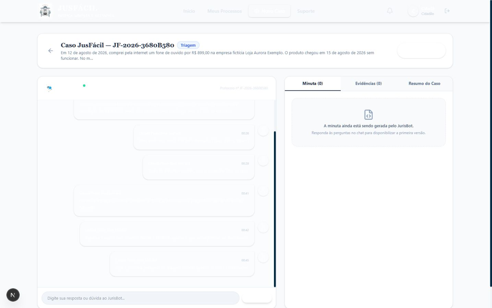
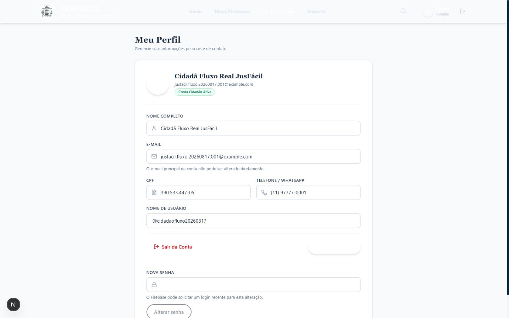
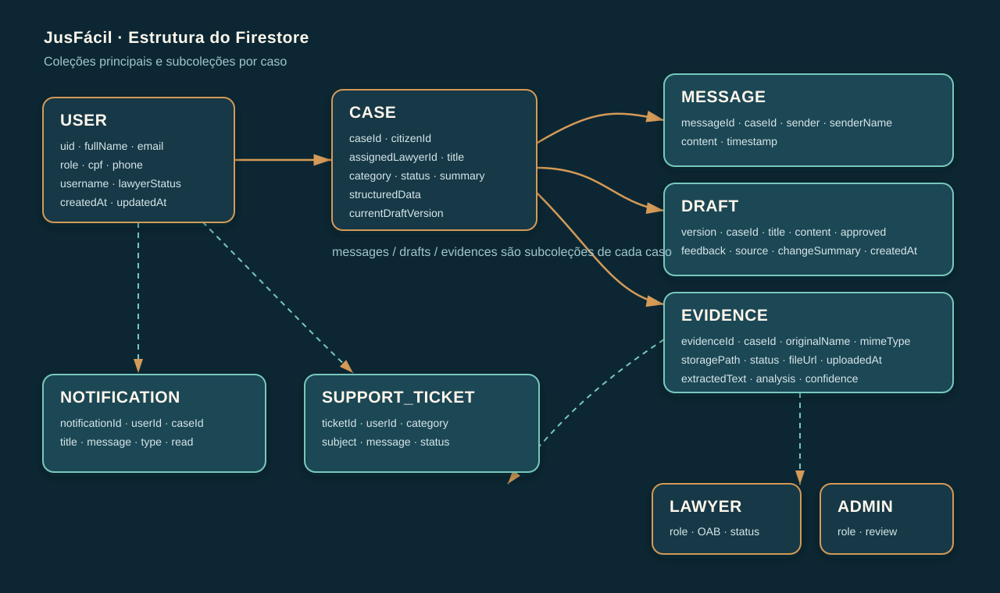
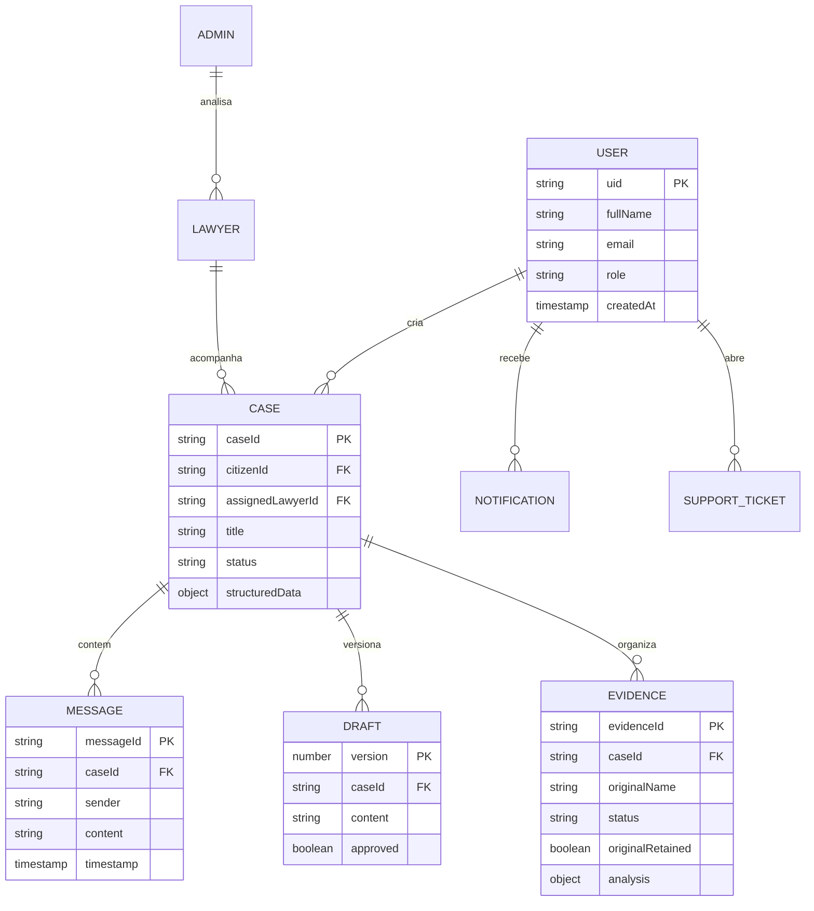

# JusFácil

> 🚧 **PROJETO EM DESENVOLVIMENTO**
>
> O JusFácil está em evolução contínua. Algumas integrações, funcionalidades e validações ainda estão em andamento. Este repositório representa o estado atual de desenvolvimento do projeto e é utilizado como portfólio técnico.

Plataforma web de auxílio à organização de demandas cíveis, evidências e minutas, com triagem conversacional assistida por inteligência artificial. O projeto explora autenticação por perfis, autorização por caso, persistência documental e respostas estruturadas de IA em uma aplicação full stack.

> **Aviso jurídico:** o JusFácil é um projeto educacional e de portfólio. Ele não substitui advogado, Defensoria Pública, órgão público ou decisão judicial; não protocola ações, não garante resultados e não deve ser tratado como sistema pronto para produção.

## Sobre o projeto

O JusFácil é uma plataforma LegalTech em desenvolvimento para auxiliar pessoas na organização inicial de determinadas demandas jurídicas. O fluxo inclui:

- relato do problema em linguagem natural;
- triagem assistida pelo JurisBot e perguntas complementares;
- estruturação dos fatos e da linha do tempo;
- organização de evidências;
- geração assistida e versionamento de minutas;
- acompanhamento do caso;
- possibilidade de revisão humana quando necessária.

Operações sensíveis no servidor verificam o Firebase ID Token e a autorização sobre o caso antes de acessar a OpenAI ou persistir alterações.

```text
Navegador
  ├── Firebase Authentication
  ├── Firestore protegido por regras
  └── Next.js Route Handlers
        ├── verificação de ID Token
        ├── autorização por usuário, papel e caso
        ├── OpenAI Responses API + Structured Outputs + Zod
        ├── extração temporária de evidências, sem reter o arquivo original
        └── Firebase Admin + persistência de dados estruturados
```

## 🚧 Status do desenvolvimento

| Área | Estado | Observação |
|---|---|---|
| Interface responsiva | Em refinamento | Fluxos principais implementados para desktop e mobile |
| Next.js, React e TypeScript | Implementado | App Router, componentes e rotas de servidor |
| Firebase Authentication | Parcialmente validado | Cadastro, login e logout validados com Firebase real; recuperação de senha implementada, com validação E2E pendente. |
| Cloud Firestore | Validado | Perfil cidadão e caso fictício persistidos no projeto real |
| Evidências sem Storage | Parcialmente validado | TXT validado ponta a ponta com OpenAI real; PDF, DOCX, CSV, XLSX, PNG e JPG possuem suporte implementado, mas aguardam validação E2E real. |
| JurisBot | Validado | Autenticação, autorização, perguntas progressivas e persistência validadas com caso sintético |
| OpenAI API | Validado | Responses API com `gpt-5.6-luna` validada por chamadas reais e baixo custo |
| Structured Outputs + Zod | Validado | Respostas reais validadas pelo schema e contratos cobertos por testes automatizados |
| Minutas e versionamento | Validado | Geração V1, revisão V2, histórico, aprovação e PDF validados ponta a ponta |
| Portal do advogado | Em desenvolvimento | Aprovação e atribuição explícita previstas no fluxo |
| Administração | Em desenvolvimento | Área protegida existente, ainda sem validação funcional final |
| Testes automatizados | 49 aprovados | 7 arquivos de unidade, API, componentes, schemas e regras de domínio; Rules não executadas nesta rodada por Java 8 |
| Deploy público | Planejado | Este repositório ainda não representa uma versão de produção |

## Progresso

### ✅ Concluído

- [x] Migração do protótipo para Next.js
- [x] React, TypeScript e layout responsivo base
- [x] Firebase Authentication e persistência no Firestore
- [x] API server-side do JurisBot
- [x] Verificação do Firebase ID Token no backend
- [x] Autorização por caso
- [x] Zod e Structured Outputs
- [x] Remoção de fallbacks jurídicos fictícios
- [x] Validação ponta a ponta do JurisBot com OpenAI real
- [x] Evidência TXT processada sem retenção do arquivo original
- [x] Geração, revisão, aprovação e PDF de minuta com dados sintéticos
- [x] Testes automatizados e build de produção

### 🟡 Em desenvolvimento

- [ ] Validação E2E real dos demais formatos de evidência além de TXT
- [ ] Refinamento visual e ampliação opcional do processamento de evidências
- [ ] Testes E2E e testes de Rules com Firebase Emulator
- [ ] Revisões jurídica e LGPD
- [ ] Deploy público

## 📸 Interface

Todas as telas autenticadas abaixo usam uma conta e um caso completamente fictícios.

<table>
  <tr>
    <td width="50%"><br><sub>Login</sub></td>
    <td width="50%"><br><sub>Cadastro cidadão</sub></td>
  </tr>
  <tr>
    <td><br><sub>Início e acompanhamento</sub></td>
    <td><br><sub>Meus processos</sub></td>
  </tr>
  <tr>
    <td><br><sub>Novo caso</sub></td>
    <td><br><sub>JurisBot com caso fictício</sub></td>
  </tr>
  <tr>
    <td><br><sub>Minuta versionada para revisão</sub></td>
    <td><br><sub>Perfil</sub></td>
  </tr>
</table>

## Tecnologias

- Next.js 16, React 19 e TypeScript 5.9
- Tailwind CSS 4
- Firebase Authentication, Cloud Firestore e Admin SDK
- OpenAI API com Structured Outputs
- Zod para validação de dados estruturados
- Vitest, Testing Library e Firebase Rules Unit Testing
- jsPDF, Mammoth, ExcelJS e PDF Parse para documentos e evidências

## Modelo de dados





## 🗄️ Estrutura do banco de dados

| Caminho | Campos principais | Finalidade |
|---|---|---|
| `/users/{uid}` | `uid`, `fullName`, `email`, `role`, `cpf`, `phone`, `username`, `lawyerStatus`, `createdAt`, `updatedAt` | Perfil e papel de acesso |
| `/cases/{caseId}` | `caseId`, `citizenId`, `assignedLawyerId`, `title`, `category`, `summary`, `originalStory`, `status`, `structuredData`, `currentDraftVersion`, `createdAt`, `updatedAt` | Caso e estado da triagem |
| `/cases/{caseId}/messages/{messageId}` | `messageId`, `caseId`, `sender`, `senderName`, `content`, `timestamp` | Histórico conversacional |
| `/cases/{caseId}/drafts/{version}` | `version`, `caseId`, `title`, `content`, `approved`, `feedback`, `source`, `changeSummary`, `createdAt` | Minutas versionadas |
| `/cases/{caseId}/evidences/{evidenceId}` | `evidenceId`, `caseId`, `originalName`, `mimeType`, `size`, `status`, `originalRetained`, `analysis`, `uploadedAt` | Metadados e análise estruturada; o original e o texto bruto não são persistidos |
| `/notifications/{notificationId}` | `notificationId`, `userId`, `caseId`, `title`, `message`, `type`, `read`, `createdAt` | Notificações por usuário |
| `/supportTickets/{ticketId}` | `ticketId`, `userId`, `category`, `subject`, `message`, `status`, `createdAt`, `updatedAt` | Solicitações de suporte |

## Funcionalidades implementadas

- Cadastro e autenticação de cidadãos e advogados; Google Sign-In e recuperação de senha implementados, com validação E2E pendente.
- Perfil cidadão persistido com papel `CITIZEN`; advogado inicia com análise pendente.
- Casos com protocolo próprio, status e autorização por proprietário ou profissional atribuído.
- JurisBot autenticado com contexto e histórico lidos do Firestore no servidor, rate limit, saída estruturada e mensagens persistidas.
- Prompts orientados a perguntar informações ausentes e a não inventar nomes, datas, valores, documentos ou fatos.
- Evidências com validação de nome, extensão, MIME e tamanho; processamento temporário no servidor e descarte do arquivo original.
- Minutas versionadas, pedidos de alteração, aprovação transacional e geração de PDF.
- Notificações, solicitação de revisão humana e suporte persistido.

## Instalação local

### Pré-requisitos

- Node.js 22 ou superior; Node.js 24 recomendado
- npm 10 ou superior
- Projeto Firebase configurado
- Chave de API OpenAI com crédito disponível
- Java 21 ou superior apenas para executar emuladores e testes de regras

```bash
git clone https://github.com/giulia05tomaz/Jusfacil.git
cd Jusfacil
npm ci
cp .env.example .env.local
npm run dev
```

No PowerShell, substitua a cópia do arquivo por:

```powershell
Copy-Item .env.example .env.local
```

Abra `http://localhost:3000`.

## Variáveis de ambiente

Copie `.env.example` para `.env.local` e preencha apenas no seu ambiente. Nunca envie credenciais ao Git.

| Variável | Uso |
|---|---|
| `NEXT_PUBLIC_FIREBASE_API_KEY` | SDK web do Firebase |
| `NEXT_PUBLIC_FIREBASE_AUTH_DOMAIN` | Domínio do Authentication |
| `NEXT_PUBLIC_FIREBASE_PROJECT_ID` | Identificador do projeto |
| `NEXT_PUBLIC_FIREBASE_STORAGE_BUCKET` | Bucket de evidências |
| `NEXT_PUBLIC_FIREBASE_MESSAGING_SENDER_ID` | SDK web do Firebase |
| `NEXT_PUBLIC_FIREBASE_APP_ID` | Identificador do aplicativo web |
| `FIREBASE_ADMIN_PROJECT_ID` | Firebase Admin no servidor |
| `FIREBASE_ADMIN_CLIENT_EMAIL` | Conta de serviço |
| `FIREBASE_ADMIN_PRIVATE_KEY` | Chave privada com quebras escapadas |
| `OPENAI_API_KEY` | JurisBot e análise de evidências |
| `ALLOW_REAL_OPENAI_SMOKE` | Trava explícita do smoke real; mantenha `0` e use `1` somente com autorização consciente de custo |
| `OPENAI_MODEL` | Modelo base usado no servidor |
| `OPENAI_CHAT_MODEL` | Modelo do JurisBot |
| `OPENAI_DRAFT_MODEL` | Modelo de minutas e revisões |
| `OPENAI_CHAT_RATE_LIMIT_MAX` | Chamadas de chat por usuário a cada minuto; padrão 12 |
| `OPENAI_DRAFT_RATE_LIMIT_MAX` | Gerações de minuta por usuário/caso a cada hora; padrão 3 |
| `OPENAI_EVIDENCE_RATE_LIMIT_MAX` | Análises de evidência por usuário/caso a cada hora; padrão 5 |

Sem credenciais válidas, o sistema deve apresentar erro explícito. Não existe resposta jurídica fictícia de fallback.

## Comandos

| Comando | Finalidade |
|---|---|
| `npm run dev` | Servidor de desenvolvimento |
| `npm run lint` | ESLint sem avisos |
| `npm run typecheck` | Verificação do TypeScript |
| `npm test` | Testes automatizados |
| `npm run test:rules` | Regras do Firestore e Storage em emuladores |
| `npm run build` | Build otimizado |
| `npm start` | Execução do build |

## Segurança

- Firebase ID Tokens são verificados no servidor antes das operações de IA.
- O acesso a casos valida propriedade, papel e atribuição explícita.
- Regras do Firestore restringem documentos por usuário e caso.
- Papéis, aprovação profissional e atribuição não podem ser promovidos pelo próprio cliente.
- Segredos ficam em variáveis de ambiente; `.env*`, arquivos PEM, contas de serviço e logs são ignorados.
- O smoke test real permanece bloqueado, salvo quando `ALLOW_REAL_OPENAI_SMOKE=1` for definido explicitamente.
- Evidências aplicam limites de extensão, MIME e tamanho; o original é descartado depois da extração/análise.
- Aprovação de minuta e notificações relacionadas usam operação transacional.
- **IN-MEMORY RATE LIMIT — DEVELOPMENT ONLY:** os limites atuais são locais à instância. Antes de qualquer deploy multi-instance, migrar os contadores para Firestore, Redis ou armazenamento compartilhado equivalente.

## Limitações conhecidas

- O fluxo sem Storage não oferece download posterior do arquivo de evidência original; somente metadados e análise estruturada permanecem no Firestore.
- PDF/DOCX/CSV/XLSX/PNG/JPG possuem suporte de código, mas apenas TXT foi validado ponta a ponta com OpenAI real nesta rodada.
- OCR para PDF exclusivamente digitalizado não está embarcado.
- Não há protocolo automático em tribunais nem consulta processual externa.
- Portais de advogado e administrador ainda precisam de validação funcional final.
- Não há deploy público e o sistema não está pronto para uso em produção.

## Estrutura do projeto

```text
src/app/                 páginas, layouts e rotas API
src/components/          componentes reutilizáveis
src/lib/ai/              prompts, schemas e integração OpenAI
src/lib/firebase/        cliente, Admin, autenticação e serviços
src/lib/evidence/        extração e validação de evidências
src/lib/cases/           autorização, elegibilidade e estados
src/tests/               testes automatizados
docs/screenshots/        capturas com dados fictícios
docs/database/           diagrama do Firestore
firestore.rules          regras do banco
firestore.indexes.json   índices compostos
storage.rules            regras de arquivos
legacy/                  protótipo estático anterior, fora do build
```

## Evolução do projeto

O diretório `legacy/` preserva o protótipo estático original somente como registro da evolução técnica. A aplicação atual vive em `src/`, não depende do protótipo e continua em desenvolvimento.
